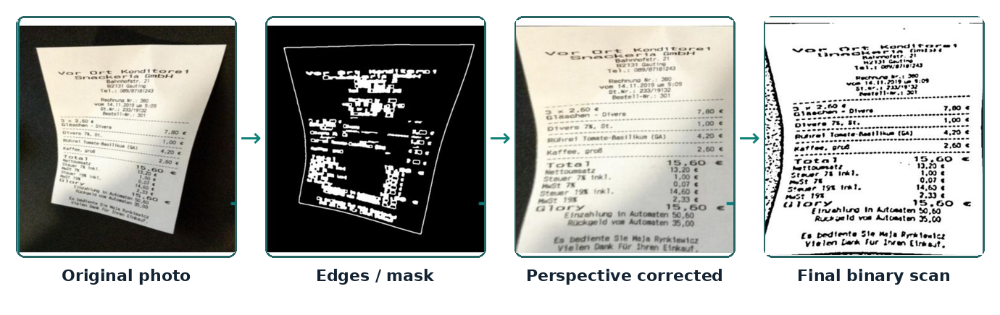
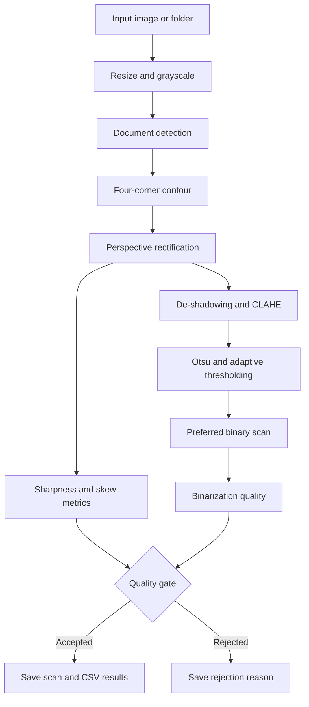

# Computer Vision Document Scanner

An OpenCV-based document scanning pipeline that transforms photos of A4 pages, receipts, and notes into clean, top-down, high-contrast scans suitable for printing and OCR preprocessing.

<p align="center">
  
</p>

## Overview

This project detects documents in real-world photographs, corrects perspective distortion, reduces shadows, improves contrast, binarizes the result, and evaluates the quality of each generated scan.

The pipeline is designed to handle:

- cluttered or non-uniform backgrounds;
- documents photographed from imperfect angles;
- shadows and uneven lighting;
- low-contrast document boundaries;
- blurry or highly skewed inputs;
- single-image and folder-based batch processing.

Low-quality inputs can be automatically rejected based on sharpness, skew, and binarization quality.

## Key Features

- Robust multi-pass document detection
- Perspective correction using a four-point homography
- De-shadowing and local contrast enhancement with CLAHE
- Otsu and adaptive thresholding
- Automatic selection of the preferred binary scan
- Sharpness estimation using the variance of the Laplacian
- Skew estimation using Hough lines
- Automatic rejection of low-quality inputs
- Batch processing for folders of images
- CSV reports containing detection, quality, and experiment results
- Visualization of intermediate processing stages

## Processing Pipeline



## How It Works

### 1. Pre-processing

The input image is resized for faster processing and converted to grayscale.

### 2. Document Detection

The system uses multiple detection strategies to locate a valid four-point document boundary:

1. bilateral filtering, Canny edge detection, and morphological closing;
2. adaptive thresholding and morphology;
3. Otsu-based blob detection;
4. Hough lines and corner detection;
5. minimum-area rectangle fallbacks.

Candidate contours are evaluated using properties such as area, convexity, aspect ratio, and rectangular fill ratio.

### 3. Perspective Rectification

The four detected corners are ordered and used to compute a perspective transformation.

OpenCV's `getPerspectiveTransform` and `warpPerspective` functions produce a top-down view of the document.

### 4. Image Enhancement

The rectified image is improved using:

- de-shadowing;
- CLAHE local contrast enhancement;
- grayscale normalization.

### 5. Binarization

Two methods are applied and compared:

- **Otsu thresholding** — effective for relatively uniform lighting;
- **Adaptive thresholding** — more robust to shadows and local lighting variation.

The pipeline selects the preferred result based on the image characteristics and binarization quality.

### 6. Quality Assessment

Each scan is evaluated using:

- **Sharpness** — variance of the Laplacian;
- **Skew angle** — estimated from Hough lines;
- **Binarization quality** — proportion and distribution of black pixels;
- **Decision** — `Accepted` or `Rejected`;
- **Rejection reason** — for example, low sharpness, excessive skew, poor binarization, or missing document contour.

## Technologies

| Technology | Purpose                                                                    |
| ---------- | -------------------------------------------------------------------------- |
| Python     | Main programming language                                                  |
| OpenCV     | Image processing, contours, Hough transforms, homography, and thresholding |
| NumPy      | Geometric calculations and image statistics                                |
| Matplotlib | Visualization of intermediate pipeline stages and experiment charts        |
| CSV / OS   | Batch processing and result reporting                                      |

## Project Structure

```text
Computer-Vision-Document-Scanner/
├── dataset/                       # Input document photographs
├── docs/
│   └── images/
│       └── example_result.png    # Example shown in this README
├── outputs_week9/                 # Generated scans, logs, and CSV reports
├── main.py                        # Main scanning pipeline
├── generate_charts.py             # Experiment chart generation
├── binarization_pie_chart.png
├── success_rate_by_lighting.png
├── requirements.txt
├── Documentatie.pdf               # Final project report
├── prezentare.pdf                 # Final presentation
└── README.md
```

## Installation

### 1. Clone the repository

```bash
git clone https://github.com/AndreeaStati/Computer-Vision-Document-Scanner.git
cd Computer-Vision-Document-Scanner
```

### 2. Create a virtual environment

#### Linux or macOS

```bash
python3 -m venv .venv
source .venv/bin/activate
```

#### Windows

```powershell
python -m venv .venv
.venv\Scripts\activate
```

### 3. Install the dependencies

```bash
pip install -r requirements.txt
```

## Usage

1. Add `.jpg`, `.jpeg`, or `.png` document photos to the `dataset/` directory.
2. Run the application:

```bash
python main.py
```

During visualization:

- press **Enter** to continue to the next image;
- press **Q** or **Escape** to stop processing.

## Generated Outputs

For each detected document, the pipeline can generate files such as:

```text
<image>_warped.jpg
<image>_deshadow.jpg
<image>_otsu.jpg
<image>_adaptive.jpg
<image>_preferred.jpg
```

The batch-processing workflow also produces CSV reports, including:

```text
summary_week9.csv
experiments_week9.csv
```

The reports contain information such as:

- input filename;
- detection method;
- preferred binarization method;
- sharpness score;
- skew angle;
- lighting and background category;
- acceptance decision;
- rejection reason.

## Dataset and Evaluation

The project was developed and evaluated on a dataset of **50 real-world document photographs** captured under different:

- camera angles;
- lighting conditions;
- backgrounds;
- shadow levels;
- document types.

The evaluated methods include:

- simple Canny detection versus multi-pass detection;
- Otsu versus adaptive thresholding;
- enhancement with and without de-shadowing and CLAHE;
- output generation with and without automatic quality rejection.

## Reported Results

On the reported demonstration subset:

| Metric             |       Result |
| ------------------ | -----------: |
| Document detection | 9 / 9 images |
| Accepted scans     | 7 / 9 images |
| Acceptance rate    |        77.8% |

Most rejected inputs were affected by motion blur, low sharpness, excessive skew, or weak binarization.

## Example Result

The example below illustrates the main stages of the pipeline:

1. original photograph;
2. detected edges or document mask;
3. detected document contour;
4. perspective-corrected image;
5. enhanced image;
6. final binarized scan;
7. quality assessment and acceptance decision.

<p align="center">
  
</p>

## Possible Improvements

- OCR integration for automatic text extraction
- Automatic document orientation correction
- More advanced illumination normalization
- Deep-learning-based document boundary detection
- Mobile or web interface
- Evaluation on a larger and more diverse dataset

Academic project developed for the **Artificial Vision Systems** course.
